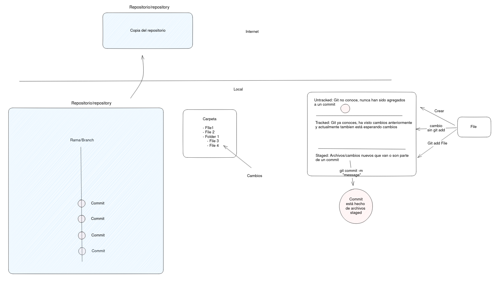

# Ayudantía 2

## Objetivos

- Aprender nuevos conceptos de repositorios GIT (Untracked/tracked/staged files).
- Aprender nuevos comandos para diagnosticar errores comunes en GIT .

## Conceptos
- Archivos y cambios: Como ve git los cambios de nuestros archivos y como a partir de estos armarmos un commit.



- Diagnosticos de problemas utilizando nuevos comandos.
```
git remote -v ~> Lista todos los repositorios en la nube en donde se pueden subir nuestro repositorio local.
git rm -r --cached <PATH/FILE> ~> Nos permite llevar un archivo desde la zona tracked a untracked. Se necesita hacer un commit de este cambio 
```
- Entender la importancia de la carpeta ```.git``` dentro de un repositorio.

## Práctica
- https://www.atlassian.com/es/git/tutorials/syncing
